# Security testing:

## SonarQube Integration with Jenkins Pipeline \| Sonar Scanner on
Jenkins Server \| Jenkins CI/ test CD ():

These are the steps that we have to follow to Integrate SonarQube with
Jenkins using Jenkins Pipeline

1.  Install SonarQube Scanner Plugin to integrate Jenkins with
    SonarQube.

2.  Adding SonarQube tool in Jenkins.

3.  Generating Tokens for Jenkins to authenticate.

4.  Adding Sonar-scanner in Jenkins.

5.  One minor change in sonar-scanner.properties.

6.  One minor change in POM.xml

7.  Write Jenkins file-\> a) Git clone

b\) Sonar-analysis-properties

8\. Build the job. Check the code coverage in SonarQube

**Before beginning with the integration, we have to install maven**

## Install maven:

Through these commands, we install maven in our Debian virtual machine

\$ sudo apt install maven

\$ mvn -version

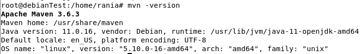

## Step 1: Install SonarQube scanner plugin

The first thing is to make sure about the installation of SonarQube
scanner plugin

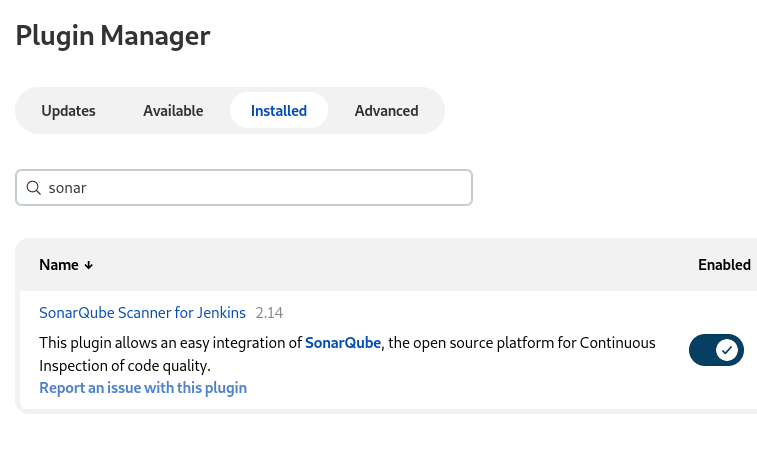

## Step 2: Adding SonarQube tool in Jenkins.

We have to go to manage Jenkins\>configure system; in the configuration
of SonarQube servers add name of server & the URL

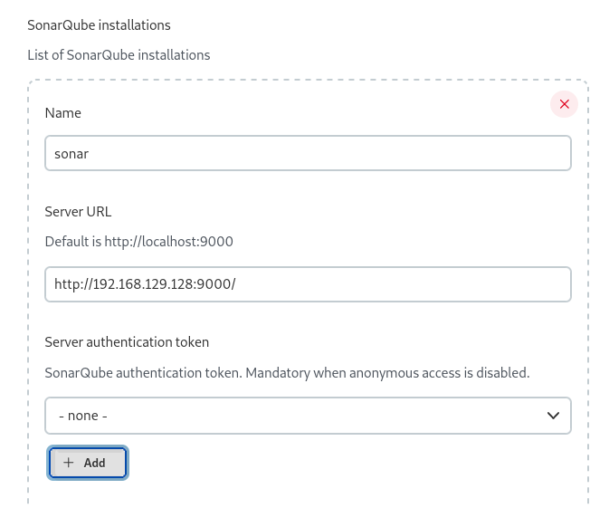

## Step 3: Generating Tokens for Jenkins to authenticate.

**In SonarQube, go to my account\>security\>generate tokens**

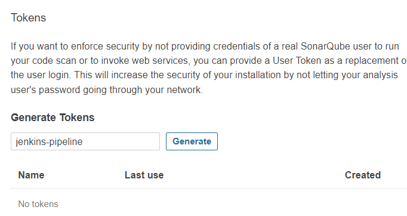

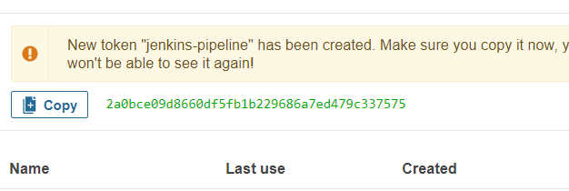

**Tokens: 2a0bce09d8660df5fb1b229686a7ed479c337575**

## Step 4: Adding Sonar-scanner in Jenkins.

In the dashboard of Jenkins, we press add and select Jenkins

This window appears, In

-   kind type secret text

-   secret is the the token of SonarQube

-   ID type SONARQUBE_TOKEN

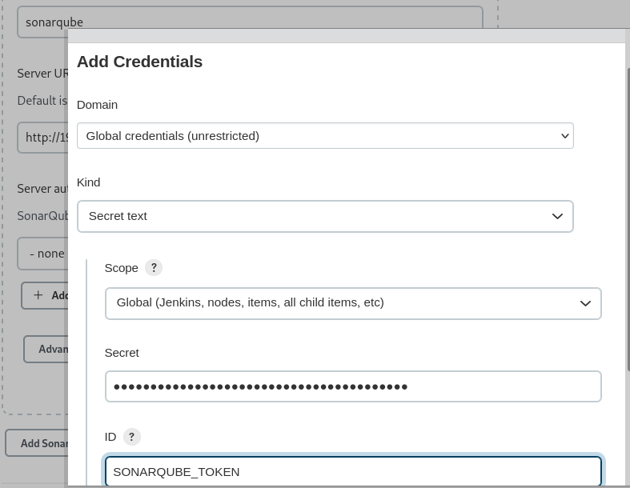

Then we go to Jenkins Dashboard, global tool configuration\> add
SonarQube scanner

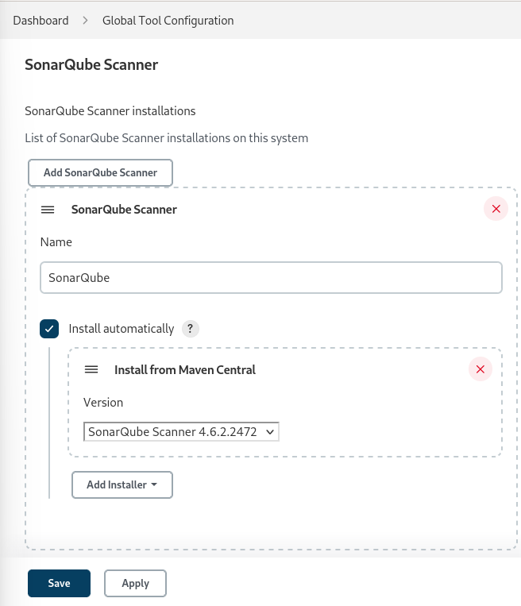

## Step 5: One minor change in sonar-scanner.properties.

In the sonar-scanner.properties file we have to add the script written
below

**\$ sudo nano /opt/sonar_scanner/conf/ sonar-scanner.properties**

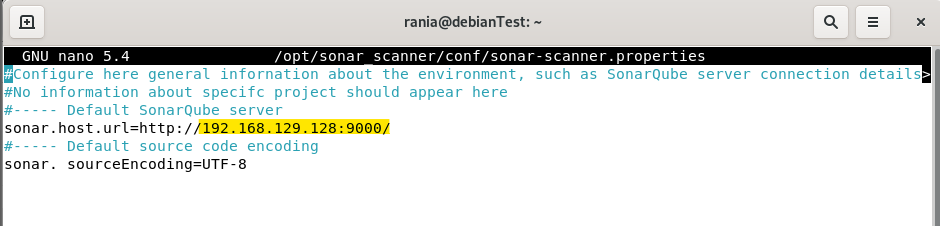

## Step 7: write Jenkins file

This is the Github repo where we will find the code

\$ URL: https://github.com/devopshint/jenkins-nexus

We have to go to Jenkins then create a pipeline

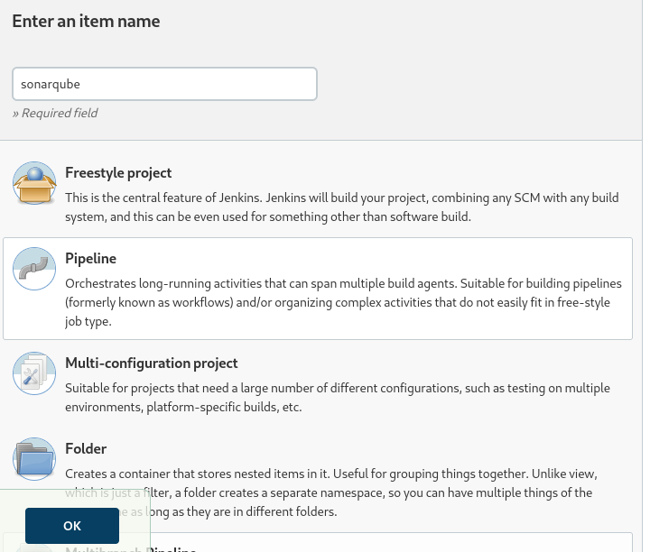

We add the github project url, then the first stage in the script that
allow us to clone the project from git then press save.

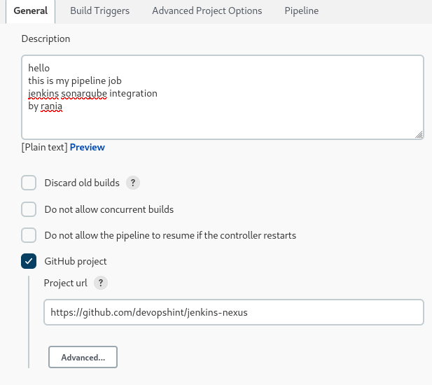

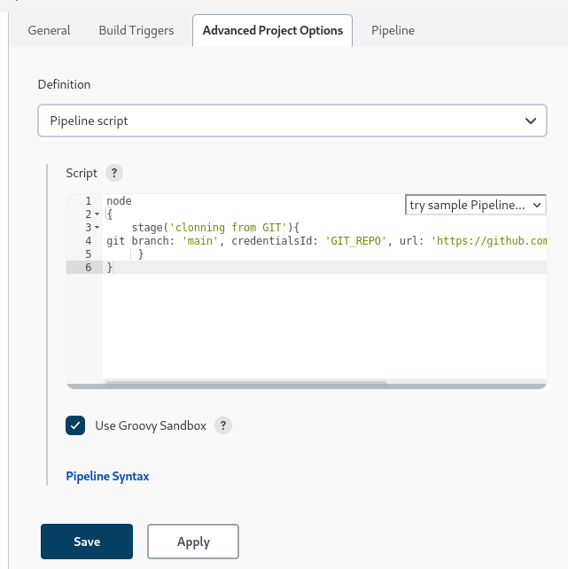

## Step 8: build the job

After press the button build now,go back to the Jenkins dashboard, the
stage view appears

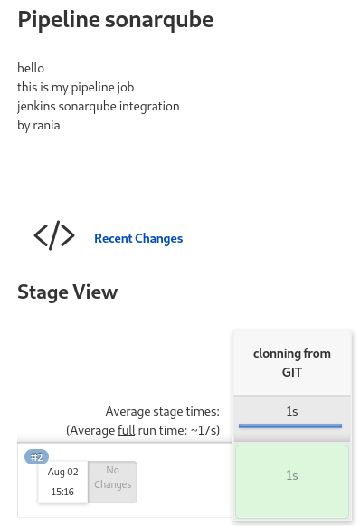 

Going to Console output we found that the clone of the repository is
completed successfully

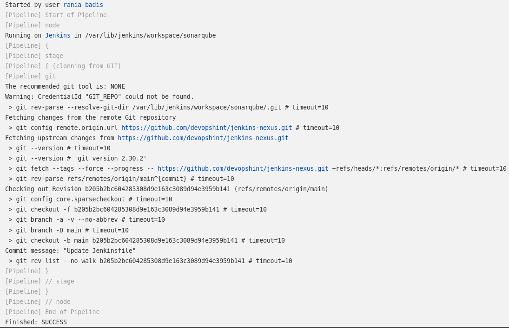

Now we add the next stage "SonarQube analysis"

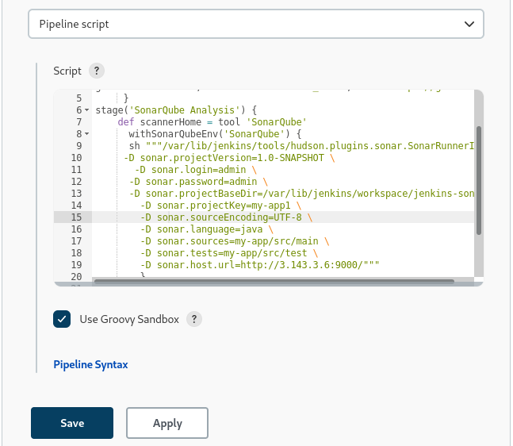

This figure shows the console output

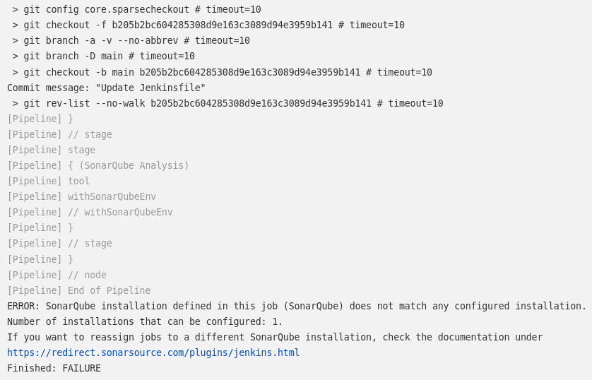

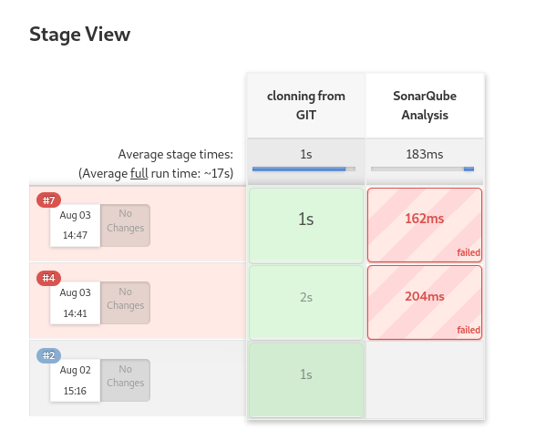
