# SonarQube

## What is SonarQube?

### SonarQube : code quality tool

SonarQube is an open-source web-based tool to manage code quality and
code analysis. It is most widely used in continuous code inspection
which performs reviews of code to detect bugs, code smells and
vulnerability issues of programming languages such as PHP, C#,
JavaScript, c/C++ and Java.

Also tracks statistics and creates charts that enable developers to
quickly identify problems in their code. Catch tricky bugs to prevent
undefined behavior from impacting end- users. Fix vulnerabilities that
compromise your application. Make sure your codebase is clean and
maintainable, to increase developer velocity!

## What is PostgreSQL?
**PostgreSQL** is an open source and powerful object-relational database
system.

The relational database is the most common type of database in use.
PostgreSQL is has very good performance and very much reliable.
PostgreSQL performance well when executing complex queries.

PostgreSQL also works well with Business Intelligence applications but
is better suited for Data Warehousing and data analysis applications
that require fast read/write speeds. PostgreSQL is complete ACID
compliant

## What is Sonar scanner?

***SonarQube Scanner or a sonar-scanner-*** performs the code analysis,
generates the results and sends the results to SonarQube. It is a
generic, CLI scanner, and you must provide configurations that list the
locations of your source files, test files, SonarQube host and URL with
domain name.

## Install and configure SonarQube

### Prerequisites:

-   OS sous Debian 11

-   Ram :4GB min

-   CPU :1vCPU

-   Java: OpenJDK 11 or oracle JRE

### Step 01: Set kernel Parameters and System Limits

Open sysctl.conf file with the folowing command and we need to add this:

\$ vim /etc/sysctl.conf

-   Vm.max_map_count=262144

-   Fs.file-max=65536

-   Ulimit -n 65536

-   Ulimit -u 4096

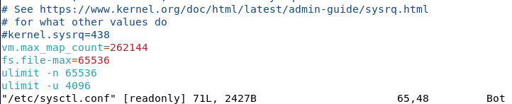

Also, in the limits.conf file add

-   sonarqube nofile 65536

-   sonarqube nproc 4096

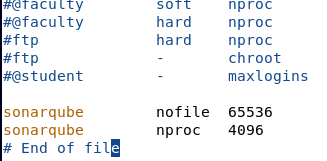

### Step 02: Install OpenJDK 11

The first thing I have to update my machine through this command

\$ sudo apt-get update -y

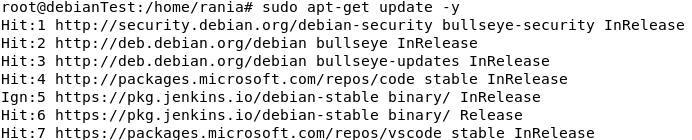

Then, install OpenJDK 11 usinf the following command

\$ sudo apt install openjdk-11-jdk

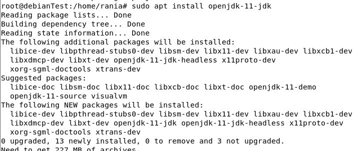

I use this command to updates all alternatives belonging to one runtime
or development kit for the Java language.

\$ sudo update-alternatives \--config java

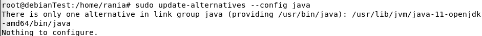

Then, I use **java -version** to check version of java**.**

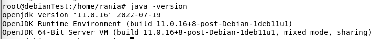

### Step 03: Install and Configure PostgreSQL Database for SonarQube

The first thing is updating our machine

\$ sudo apt update

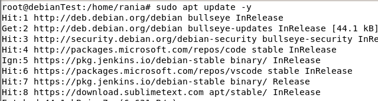

Throw these commands I have installed PostgreSQL

\$ wget -q https://www.postgresql.org/media/keys/ACCC4CF8.asc -O - \|
sudo apt-key add --

\$ sudo sh -c \'echo \"deb http://apt.postgresql.org/pub/repos/apt/
\`lsb_release -cs\`-pgdg main\" \>\> /etc/apt/sources.list.d/pgdg.list\'

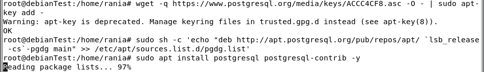

We used this command to check PostgreSQL version

\$ sudo -u postgres psql -c \"SELECT version();\"

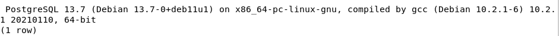

\$ sudo systemctl enable postgresql.service

\$ sudo systemctl start postgresql.service

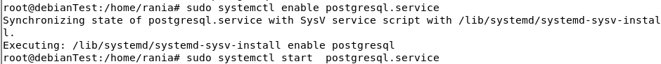

To check the status of PostgreSQL service, use this command

\$ sudo systemctl status -l postgresql.service

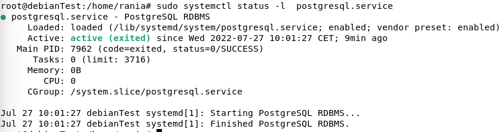

The next step is to set up Postgres password

\$ sudo passwd Postgres

Password is set into  '1234'

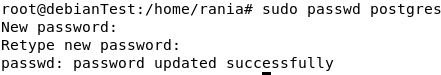

Switch to PostgreSQL User & create a new database user named "sonar
"using this command:

\$ su - postgres

\$ createuser sonar

Now, log in to the PostgreSQL database shell.

\$ psql

And, then set a password for the database user "sonar" through this
command:

\# ALTER USER sonar WITH ENCRYPTED PASSWORD \'p@ssw0rd\';

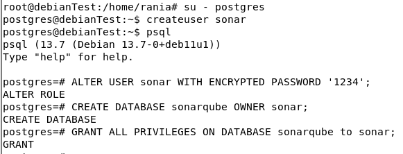

Restart and recheck PostgreSQL DB Service Status using :

\$ systemctl restart postgresql

\$ systemctl status -l postgresql

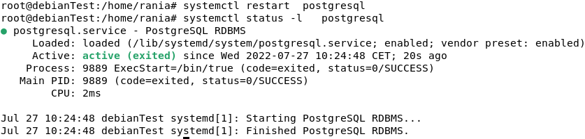

Now Check whether PostgreSQL is listing on default port "5432"

\$ netstat -tulpena \| grep postgres

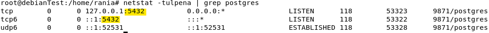

### Step 04: Download and Install SonarQube

Create a new folder named SonarQube and go to this directory using this

\$ sudo mkdir /sonarqube/

\$ cd /sonarqube/

We used this command to install SonarQube

\$ sudo curl -O
https://binaries.sonarsource.com/Distribution/sonarqube/sonarqube-8.3.0.34182.zip

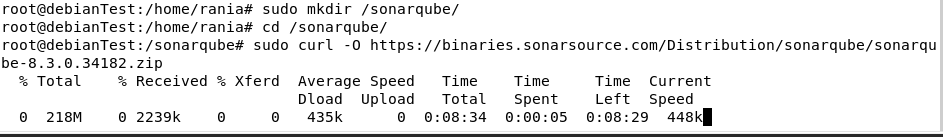

I have to install zip through this command

\$ sudo apt-get install zip

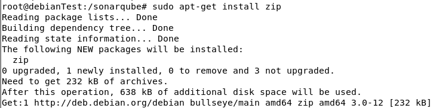

Extract your downloaded archive into /opt/ directory

\$ sudo unzip sonarqube-8.3.0.34182.zip -d /opt/

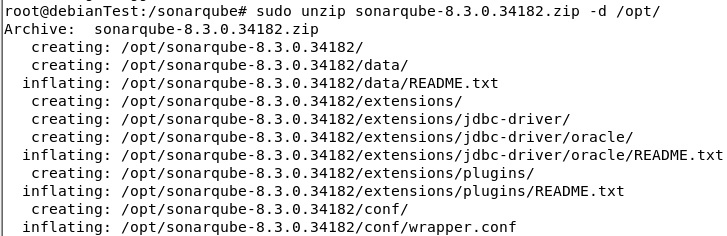
Move Extracted setup into /opt/sonarqube/ directory

**\$ sudo mv /opt/sonarqube-8.3.0.34182/ /opt/sonarqube**

### Step 05: Create Group and User for SonarQube

First, create a system group named "sonar" using;

\$ sudo groupadd sonar

\$ sudo useradd -c \"SonarQube - User\" -d /opt/sonarqube/ -g sonar
sonar

\$ sudo chown sonar:sonar /opt/sonarqube/ -R

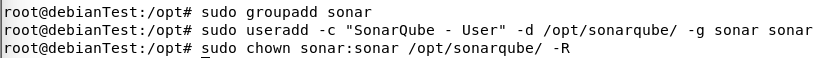

### 

### Step 06: Configure SonarQube

Open the sonar.properties file using vim

\$ sudo vim /opt/sonarqube/conf/sonar.properties

And we have to un-comment these files and I set modification:

**sonar.jdbc.username=sonar**

**sonar.jdbc.password=p@ssw0rd**

**sonar.jdbc.url=jdbc:postgresql://localhost/sonarqube**

**sonar.search.javaOpts=-Xmx512m -Xms512m
-XX:+HeapDumpOnOutOfMemoryError**

### Step 07: Configure Systemd Service for SonarQube

Open the sonar.service file using vim to add content

\$ vim /etc/systemd/system/sonarqube.service

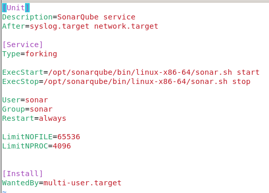

\$ systemctl daemon-reload

\$ systemctl enable sonarqube.service

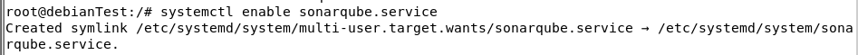

\$ systemctl start sonarqube.service

We use this command to verify the status of SonarQube service

\$ systemctl status -l sonarqube. service

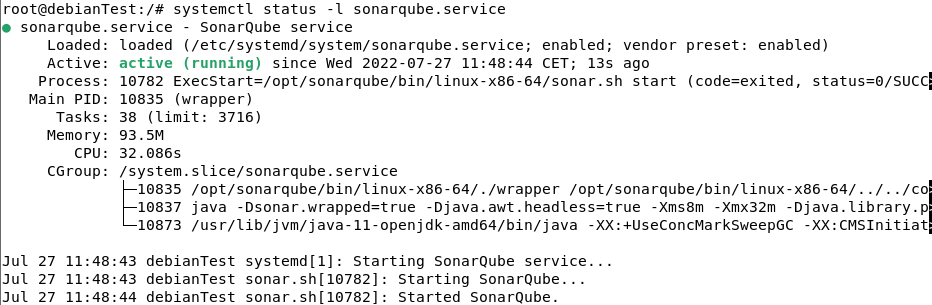

\$ netstat -tulpena \| grep 9000

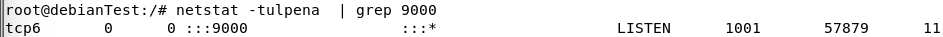
-\>the port is listening.

### Step 08: Configure NGINX Reverse Proxy for SonarQube

Install NGINX Package using

\$ apt-get install nginx -y

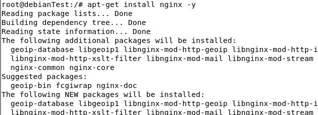

Check either SonarQube is running or not using this command:

\$ curl http://localhost:9000

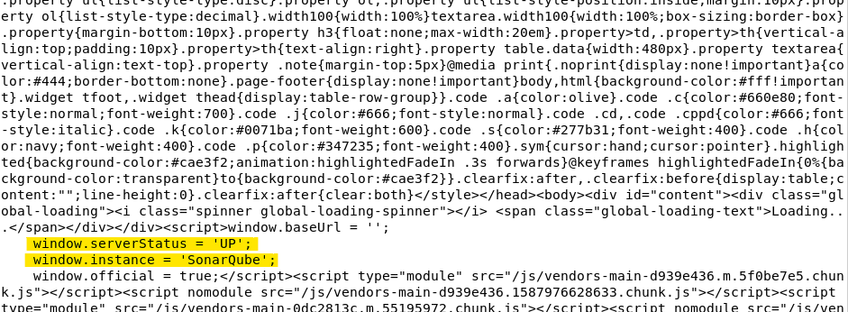

Open the configure file of nginx using vim

\$ vim /etc/nginx/nginx.conf

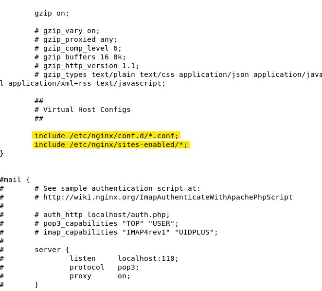

Open the configure file of SonarQube using vim

\$ sudo vim /etc/nginx/sites-enabled/sonarqube.conf

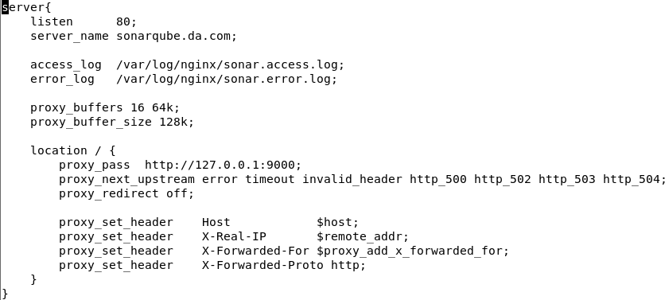

### Step 09: Firewall Configuration

We allow the port 80,9000 & 9001 to listen through the following command

\$ sudo ufw allow 80,9000,9001/tcp

We verify the status of the firewall ufw using this command

\$ sudo ufw status

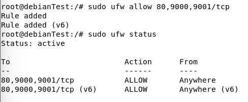

### Step 10: Access SonarQube Through Web Browser

Access to the web console through the web browser: localhost :9000

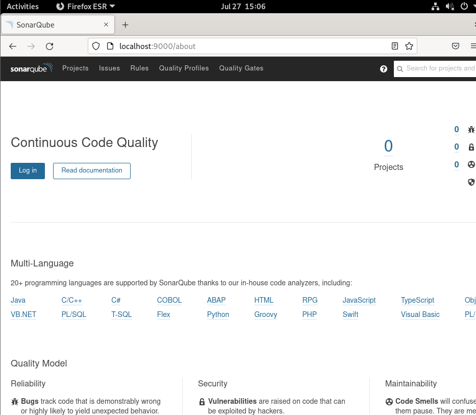

After log in:

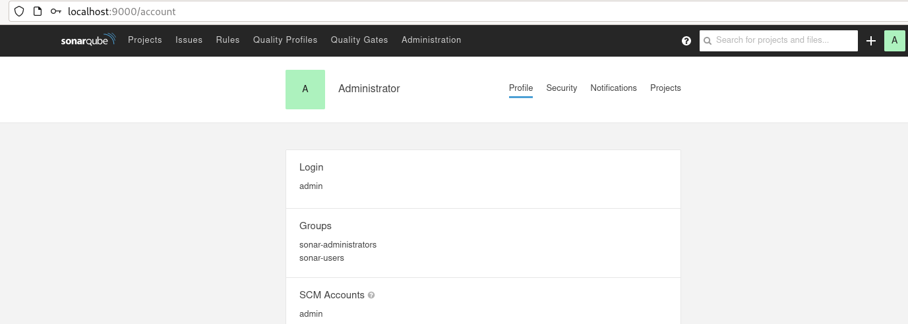
WEBOGRAPHY:

\[1\] https://digitalavenue.dev/Install-SonarQube-On-Ubuntu-Debian/
